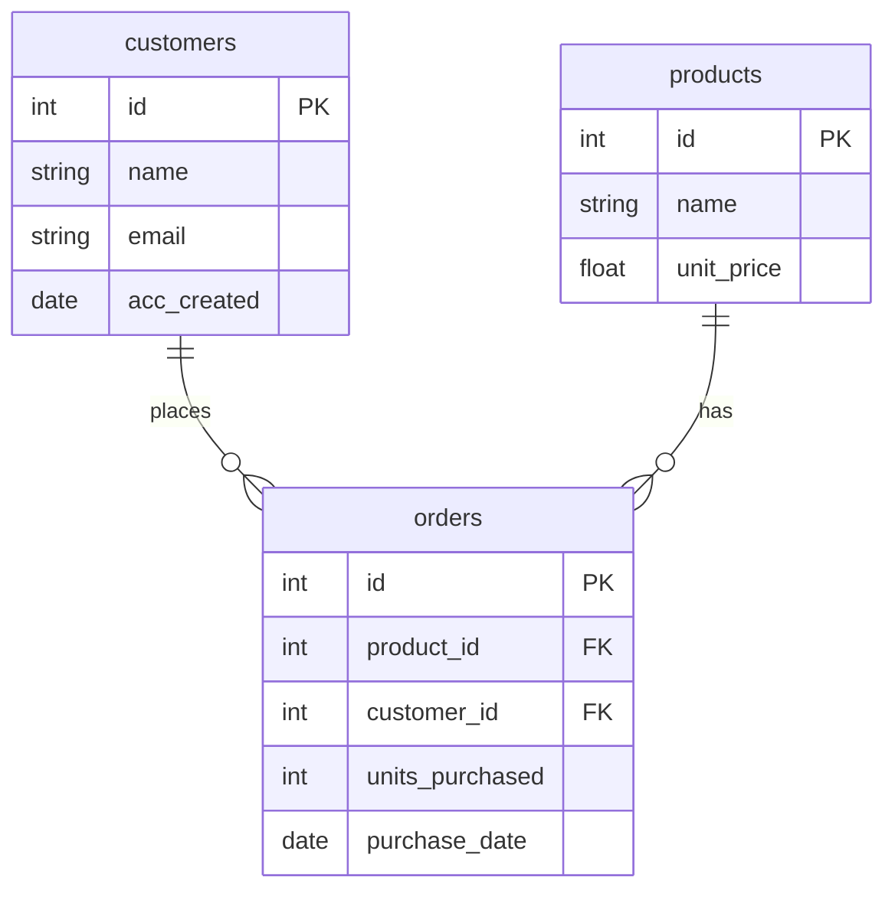

# Schema for the database

```mermaid
erDiagram
    customers {
        int id PK
        string name
        string email
        date acc_created
    }

    products {
        int id PK
        string name
        float unit_price
    }

    orders {
        int id PK
        int product_id FK
        int customer_id FK
        int units_purchased
        date purchase_date
    }

    customers ||--o{ orders : "places"
    products ||--o{ orders : "has"

```

